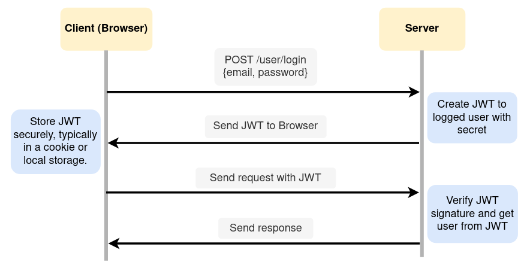

# JWT Security with Spring Boot 

This project showcases the **implementation of robust security measures for Spring Boot backend APIs using JSON Web Tokens (JWT).** 
By incorporating JWTs, it ensures the safeguarding of data integrity and authentication, making it an essential component for fortifying 
web application and API protection. JWT is a **compact, self-contained means of securely transmitting information between parties.** 
It consists of three parts, **a header, a payload, and a signature.** JWTs are often used in **authentication and authorization processes**, 
allowing systems to verify the authenticity and integrity of the data they receive, making them useful for **web applications and APIs.**

### **Here's a step-by-step explanation of how JWTs work,**

1. **Authentication and Authorization**
  * JWTs are commonly used in authentication and authorization systems. When a user logs in or requests access to a protected resource, 
a JWT is often issued to them.

2. **Token Creation**
  * To create a JWT, the server assembles three parts: the **Header**, the **Payload**, and the **Signature.**

3. **Header**
  * The Header typically consists of two parts, the **type of token** (JWT) and the **signing algorithm** being used, such as HMAC SHA256 or RSA. It is JSON encoded.
  * Example Header,
  ```json
    {
      "alg": "HS256",
      "typ": "JWT"
    }
  ```

4. **Payload**
  * The Payload contains claims, which are statements about an entity (typically, the user) and additional data. There are three types of claims: reserved, public, and private.
  * Reserved claims are standard fields like "iss" (issuer), "sub" (subject), "exp" (expiration time), and more.
  * Public claims are defined by the parties using JWT, and private claims are custom claims created to share information between parties.
  * Example Payload,
  ```json
    {
      "sub": "1234567890", 
      "name": "John Hector",
      "exp": 1632224556
    }
  ```

5. **Signature**
  * The Signature is created by taking the encoded Header, encoded Payload, a secret key (for HMAC algorithms), or a private key (for asymmetric algorithms like RSA), and the algorithm specified in the Header.
  * The signature is used to verify that the sender of the JWT is who it says it is and to ensure that the message wasn't changed along the way.
  * Example Signature (using HMAC SHA256),
  ```scss
  HMACSHA256(
    base64UrlEncode(header) + "." +
    base64UrlEncode(payload),
    secret
  )
  ```

6. **Token Assembly**
  * The three parts (Header, Payload, and Signature) are concatenated with dots to form the JWT.
  * Example JWT,
  ```css
  header.payload.signature
  ```

7. **Token Issuance**
  * The server issues the JWT to the client or user who has successfully authenticated or requested access to a resource.

8. **Token Usage**
  * The client stores the JWT securely, typically in a cookie or local storage.
  * The client includes the JWT in the **Authorization** header or as a parameter in API requests when accessing **protected resources.**

9. **Verification**
  * When the server receives a request with a JWT, it extracts the Header and Payload.
  * It then calculates a new signature using the extracted Header and Payload and the same **secret key.**
  * If the **newly calculated signature matches the received signature**, the JWT is considered valid and trusted.
  * The server can also check the expiration time and other claims in the Payload to ensure the token is still valid and hasn't expired.

10. **Access Control**
  * The server uses the claims in the Payload to determine if the client has the necessary permissions to access the requested resource.
  * If the JWT is valid and the claims authorize access, the request is processed.

### JWT working procedure in between client and server



In the project, **company profiles web service** is exposed as an **API** under the **company profiles** resource and more information on the company profile web
service can be found in the below API documentation.

- [**API documentation**](https://documenter.getpostman.com/view/25306703/2s9Y5YS34g)

## Used Technologies

- Java SE 17
- Spring Boot 3.0.5
- Apache Maven 3.8.6
- MySQL Community Server 8.0.33
- Added dependencies to pom.xml
    - spring-boot-starter-web
    - spring-boot-starter-data-jpa
    - spring-boot-starter-aop
    - spring-boot-starter-security
    - spring-boot-starter-test
    - spring-boot-devtools
    - lombok
    - mysql-connector-java 8.0.33
    - jjwt-api 0.11.5
    - jjwt-impl 0.11.5
    - jjwt-jackson 0.11.5

#### Used Integrated Development Environment
- IntelliJ IDEA

## How to use ?
This project can be used by cloning the 
project to your local computer.

Make sure to create a **db** database in the MySQL community server.
If neglect to create, the project will automatically generate it when it is firstly executed.

#### Clone this repository
1. Clone the project using `https://github.com/PubuduJ/jwt-security-with-spring-boot.git` terminal command.
2. Open the `pom.xml` file from **IntelliJ IDEA**, make sure to open this as a project.
3. Change the `spring.datasource.password` in the `application.properties` to your local machine MySQL server password.

## Version
v1.0.0

## License
Copyright &copy; 2023 [Pubudu Janith](https://www.linkedin.com/in/pubudujanith/). All Rights Reserved.<br>
This project is licensed under the [MIT license](LICENSE.txt).